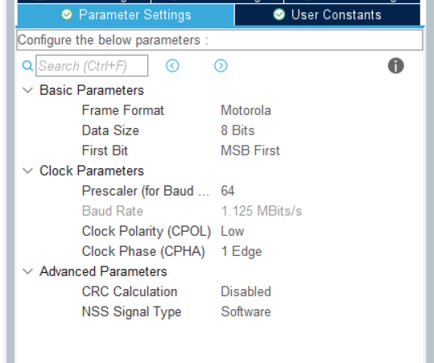
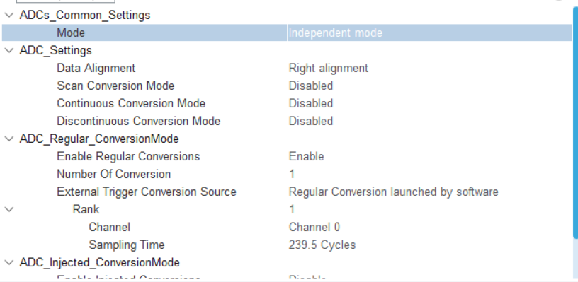
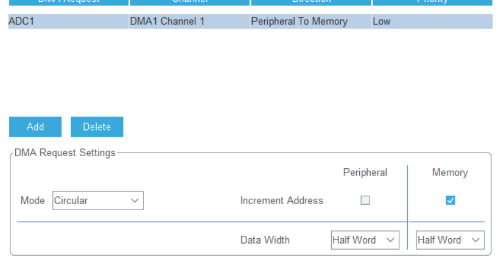

### lm5116数控可调电源

- 输入电压：24V的学生电源

- 目标输出电压：5V-12V
- 目标输出电流：（越大越好）
- 使用0.96寸oled屏显示电压值

### 电路

#### 一、控制器件

- 主要的电压控制器件还是lm5116
- 其中的stm32f103c8t6还是起到辅助的作用。
  - 控制数字电位器的电阻大小
  - 采集电压
  - 接收按键的输入
  - 控制屏幕的显示内容

#### 二、输出电压的调节

- 使用数字电位器调节反馈端的电压，一次来改变输出电压的大小。

#### 三、数据采集

- 使用ADC将电压采集到单片机。
- 再实时数据通过串口传到电脑

#### 四、控制

- 使用按键进行操作。

#### 五、辅助电源

- 使用TD1469将24V的输入降至5V，在使用HX9193将5V的电压降至3.3V个stm32 、数字电位器供电、屏幕供电。

### 代码

#### 一、数字电位器（MCP41100）

- 数字电位器的配置如图所示：

没有用到DMA或是中断，需要的话后续再来给他加上。

- 使能数字电位器

  ~~~c
  #define MCP41100_ENABLE     0B00010011
  #define MCP41100_DISABLE    0B00100000
  ~~~

- 调节数字电位器

  - 数字电位器将100k$\Omega$的电阻分成256份，在使用时，只需将其换算即可。

- 代码

~~~c
uint8_t command;
uint8_t data;

void MCP41100_Send_Data(uint8_t commands, uint8_t datas) {
    HAL_GPIO_WritePin(GPIOA, GPIO_PIN_4, GPIO_PIN_RESET);//来低数字电位器的CS引脚，开始准备通讯
    HAL_Delay(0);
    HAL_SPI_Transmit(&hspi1, &command, 1, 0xffff);//传送命令字节
    HAL_SPI_Transmit(&hspi1, &data, 1, 0xffff);//传送数据字节
    HAL_Delay(0);
    HAL_GPIO_WritePin(GPIOA, GPIO_PIN_4, GPIO_PIN_SET);//将CS引脚拉高，关闭通讯
}

~~~

==相应的文件以放在divice-library文件夹中==

#### 二、延时函数

==相应的文件以放在divice-library文件夹中==

#### 三、OLED屏

- 在此次的项目中，使用了软件iic。

- 其中OLED屏的驱动也是从别处搬来的，后续咋来研究是怎么写的。

- 相关的函数说明

~~~c
 OLED_Init();	//初始化OLED
 OLED_Fill(0x00);//清屏
 OLED_ShowStr(0, 0, "hell world");//在指定位置显示字符串
 OLED_ShowFloat(0,0,123.456f);//在指定的位置显示浮点数（小数点后三位）
~~~

==相应的文件以放在divice-library文件夹中==

#### 四、 数据类型转化

- 将浮点数转化为字符串

~~~c

void numTostring(float num, char str[10]) {

    char ch[10];
    int i = 0;//跟随ch
    int j = 0;//跟随str
    //判断是否是负数
    if (num < 0) {
        num = -num;
        str[j++] = '-';

    }
    //判断是否是小数，如果是小数，先加上0；
    if (num < 1) {
        str[j++] = '0';

    }
    //将小数乘上1000，意味着将该数字精确到小数点后三位，要改精度就改一下1000这个数字就行
    num *= 1000;
    int nums = (int) num;//将小数转换为整数
    for (i = 8; i >= 0; i--) {
        if (i == 5) {
            ch[i] = '.';
            i--;
        }
        ch[i] = nums % 10 + '0';
        nums /= 10;
    }
    //加上小数点
    ch[9] = '\0';
    i = 0;
    while (ch[i] == '0') {
        i++;
    }
    for (i; i <= 9; i++) {
        str[j] = ch[i];
        j++;
    }
}
~~~

==相应的文件以放在divice-library文件夹中==

- 该转换方式还是有点过于复杂，后续还需学习更加方便的转换方法。

#### 五、ADC电压采样

- ADC的简单配置如下：
  - **Data Alignment**：选则有对齐
  - **Scan Conversion Mode：**此项选择扫描模式使能，代表15路ADC输入分别扫描，如果不使能，其只会读取一个输入的值。
  - **Contionous Conversion Mode:**此项选择连续扫描模式，表示将连续不断的对ADC的值进行转换，如果此项不使能，将会只采集一次就停止，直到下一次使能才继续进行一次AD转换。
  - **DisContionous Conversion Mode:**此项与第三项重复。
  - **Number of Conversion：**此处有多少路输出就选择多少。
  - **Rank：**采样时间。
- DMA的配置

- 代码

~~~c
HAL_ADC_Start_DMA(&hadc1, (uint32_t *) adc_value, 1);
//使能DMA，adc_value 为存储数据的数组，1为每一次采样的次数（该数组的大小）
~~~

~~~c
HAL_ADC_Stop_DMA(&hadc1);//失能DMA
~~~

- ADC采样时，如果想要同时采集多个电压，需要打开中断，然后再ADC中断函数中处理数据。

~~~c
void HAL_ADC_ConvCpltCallback();
~~~

可在此函数中，对采集到的电压进行数据处理。

~~~c
void HAL_ADC_ConvCpltCallback(ADC_HandleTypeDef *hadc) {
    uint32_t sum = 0;
    for (uint8_t i = 0; i < 40; i++) {
        sum += adc_value[i];
    }
    avgerage_voltage = (float) sum / 40.0f;
    avgerage_voltage = avgerage_voltage * 0.2f + last_voltage * 0.8f;
    last_voltage = avgerage_voltage;
    flag = 1;
}
~~~

#### 六、按键处理

- 消抖

~~~c
if (HAL_GPIO_ReadPin(GPIOB, GPIO_PIN_12) == GPIO_PIN_RESET) {
        HAL_Delay(10);
        while (HAL_GPIO_ReadPin(GPIOB, GPIO_PIN_12) == GPIO_PIN_RESET);
        HAL_Delay(10);
        flag = RESISTANCE_UP;
    } 
~~~

### 问题

- 该板子是一个可调压的buck电路，输入电压为24V，输出电压为5V至12V
- 可通过stm32f103c6t6，控制数字电位器，以此来控制输出电压。

- 该板子函数有一点问题
 - 按键的设置没设置好。
 - 比如lm5116发烫有点严重，可能是参数还没调好。
 - 采样的滤波还没写好。
 - ……